

#  IntegraSig 

**Canal de denúncias, relatos corporativos e apoio à gestão da NR-1**

> Visite a landing page: [IntegraSig - Canal de denúncias e NR-1](https://integrasig.com.br/landing-page)

 

## Sobre o projeto

O IntegraSig é uma plataforma SaaS white-label da **Lottus Labs** para empresas receberem e tratarem relatos sensíveis com segurança: denúncias, ocorrências, sugestões e casos de assédio, fraude ou conduta inadequada.

Cada empresa ganha o seu próprio canal público, com a sua marca, acessado por link ou QR Code. Quem relata não cria conta nem instala nada, pode enviar sem se identificar e acompanha o andamento com um protocolo e um código. Do outro lado, a empresa conduz cada caso em um painel administrativo com status, prioridade, notas internas, respostas ao denunciante e trilha de auditoria.

O produto nasceu de uma demanda concreta. A **Lei 14.457/2022** exige procedimentos de denúncia nas empresas com CIPA, a **NR-1** passou a incluir os fatores de risco psicossociais no gerenciamento de riscos ocupacionais e a **LGPD** pede cuidado redobrado com dados sensíveis. Por isso o IntegraSig também traz um módulo de questionário psicossocial (NR-1/DRPS) com resultados agregados.

Está em produção, com site institucional, portal público, painel das empresas, painel de superadministração da Lottus Labs, cobrança integrada e deploy automatizado.

 

## Prévias de algumas partes

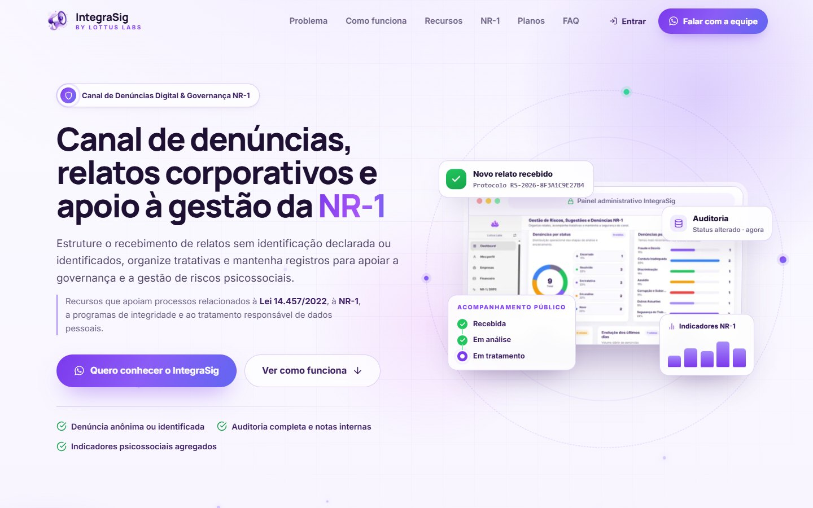

### Landing page pública de apresentação

<table>
  <tr>
    <td width="50%">
      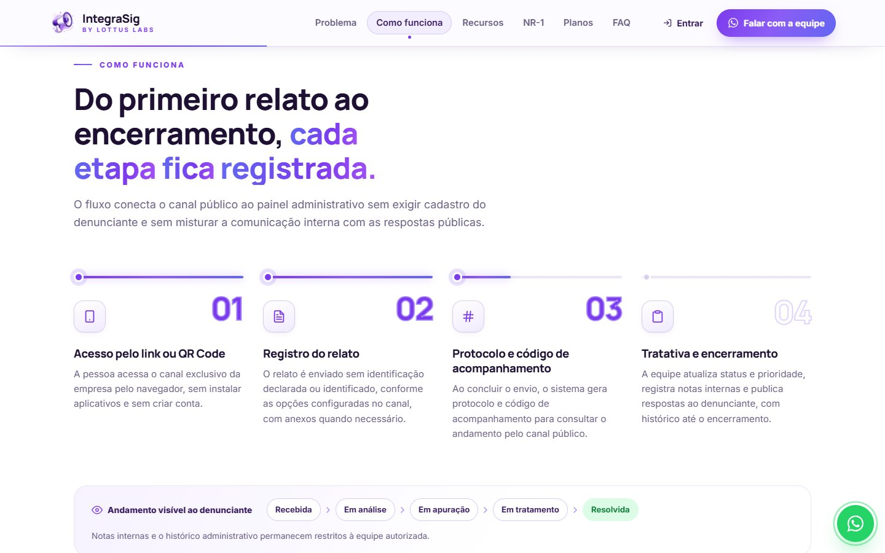
      
<b>Como funciona</b> Do primeiro relato ao encerramento, com progresso que acompanha a rolagem

    </td>
    <td width="50%">
      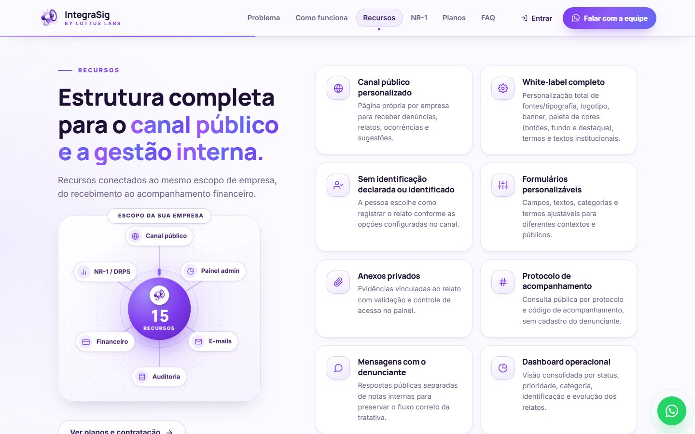
      
<b>Recursos</b> Diagrama animado do escopo da empresa e os 15 recursos da plataforma

    </td>
  </tr>
  <tr>
    <td width="50%">
      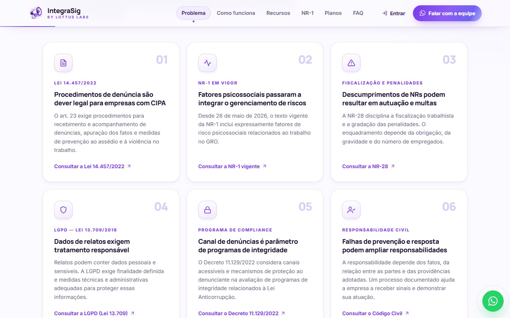
      
<b>Base legal</b> As normas que tornam o canal necessário, com links para as fontes oficiais

    </td>
    <td width="50%">
      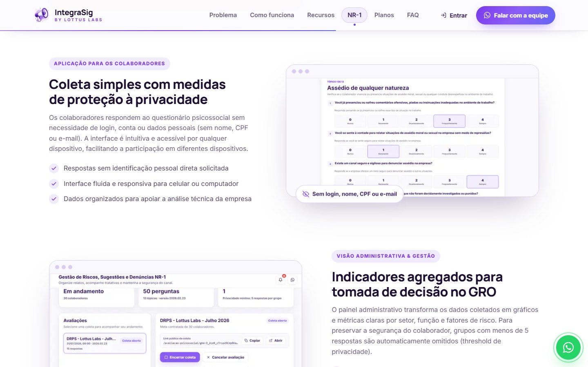
      
<b>Módulo NR-1</b> Coleta sem identificação e indicadores agregados para o GRO

    </td>
  </tr>
  <tr>
    <td width="50%">
      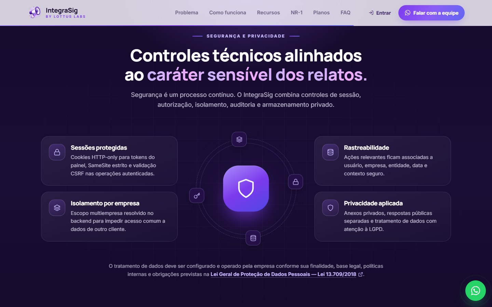
      
<b>Segurança e privacidade</b> Sessões protegidas, isolamento por empresa e rastreabilidade

    </td>
    <td width="50%">
      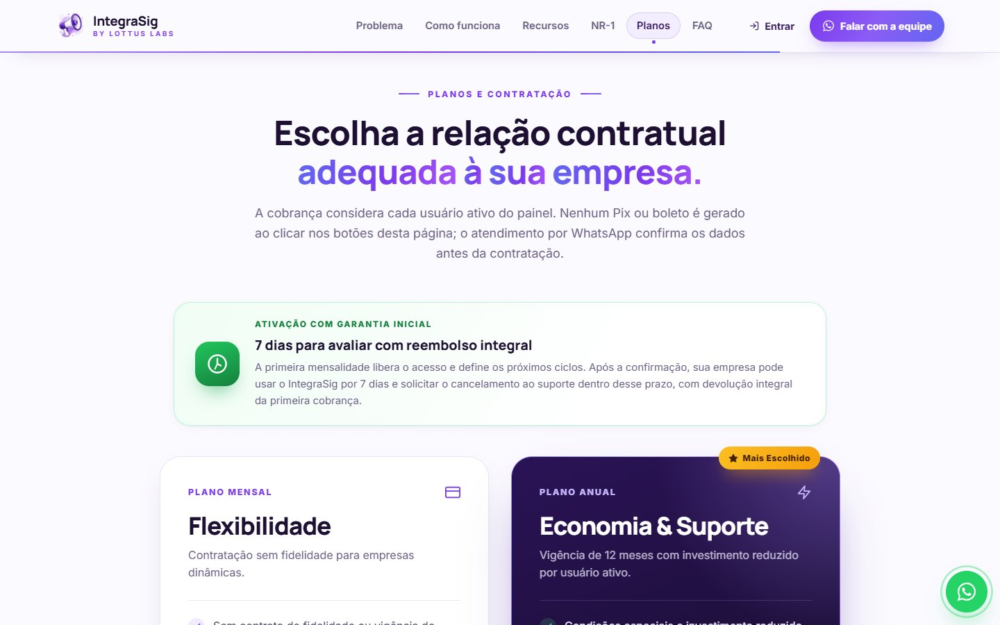
      
<b>Planos</b> Mensal ou anual, com 7 dias para avaliar e reembolso integral

    </td>
  </tr>
</table>

### Portal do denunciante

<table>
  <tr>
    <td width="50%">
      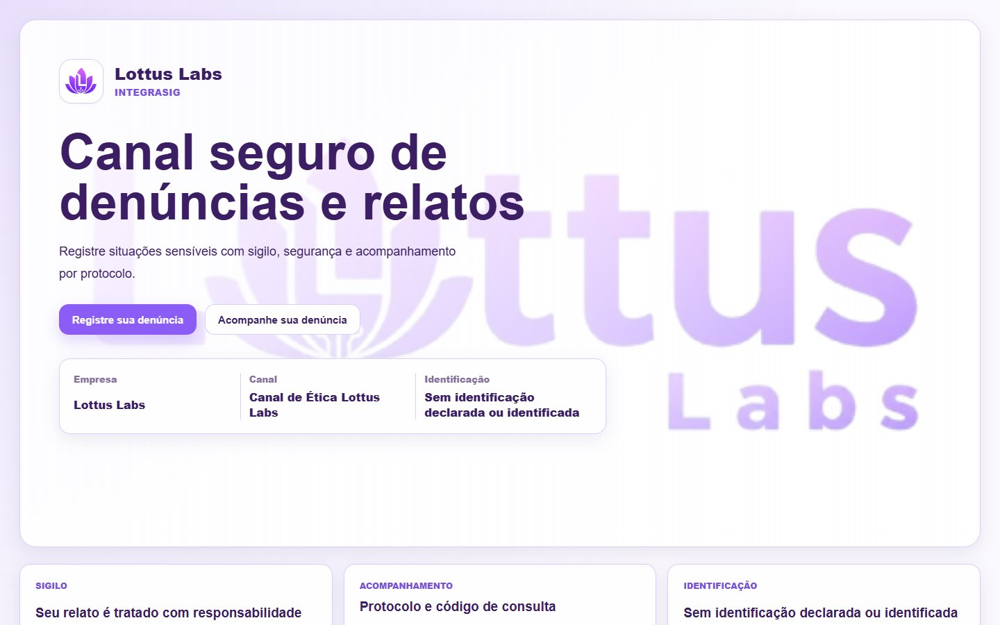
      
<b>Canal público da empresa</b> White-label: logo, cores, banner e textos de cada empresa

    </td>
    <td width="50%">
      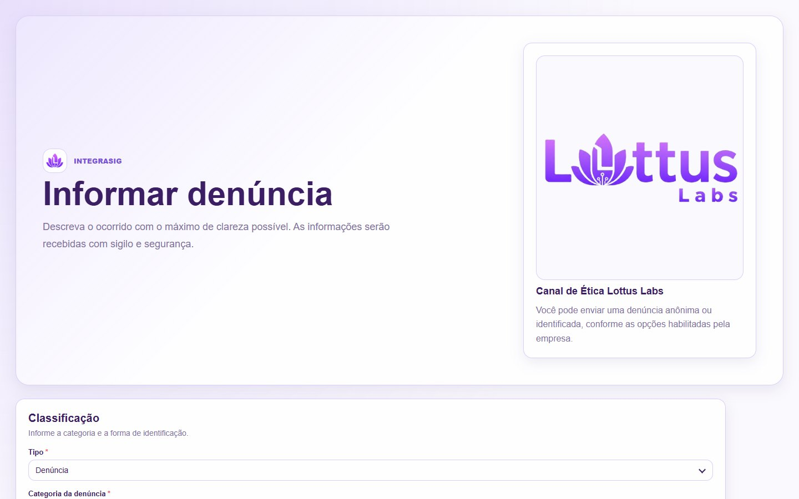
      
<b>Formulário de relato</b> Campos, categorias e identificação definidos por cada empresa

    </td>
  </tr>
  <tr>
    <td width="50%">
      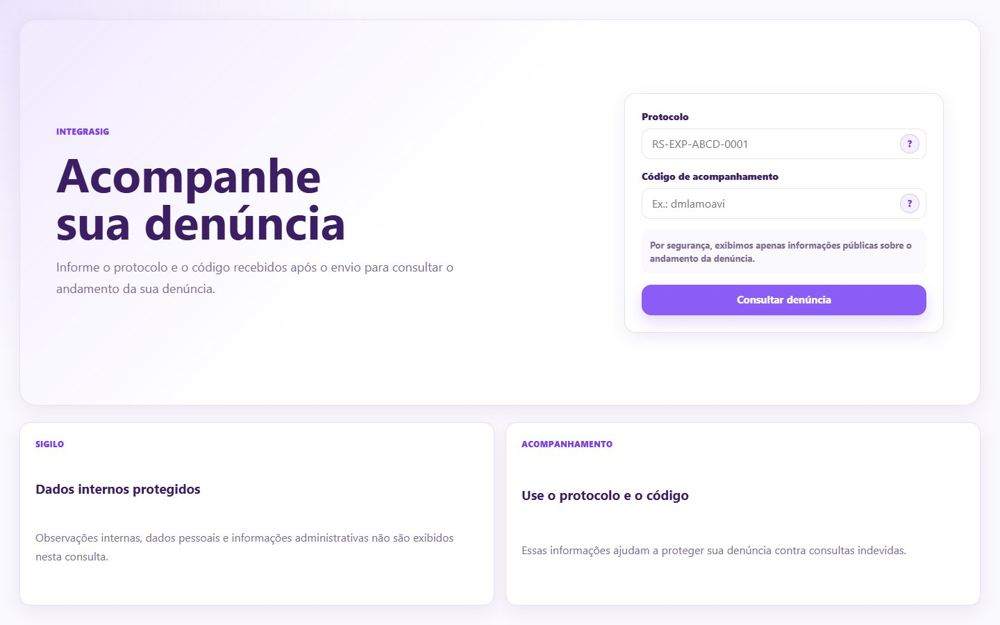
      
<b>Acompanhamento</b> Consulta por protocolo e código, sem cadastro

    </td>
    <td width="50%">
      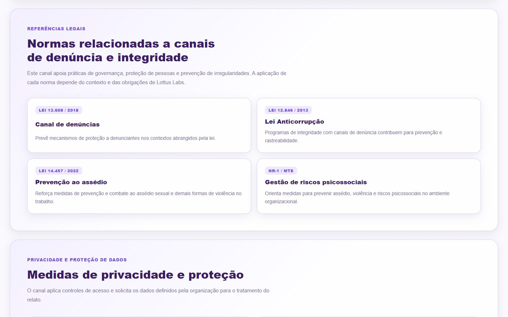
      
<b>Orientações ao denunciante</b> Normas relacionadas e medidas de privacidade no próprio canal

    </td>
  </tr>
</table>

### Painel administrativo e NR-1

<table>
  <tr>
    <td width="50%">
      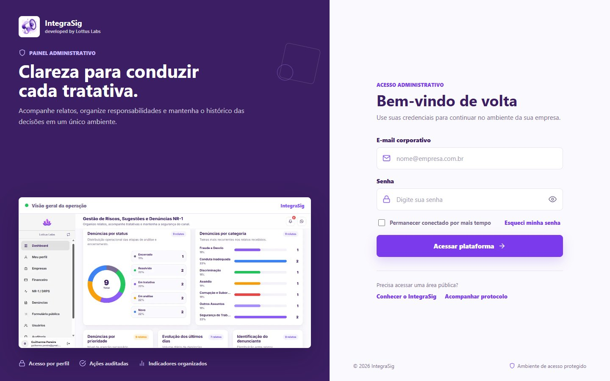
      
<b>Acesso administrativo</b> Login, primeiro acesso com troca de senha e recuperação por código

    </td>
    <td width="50%">
      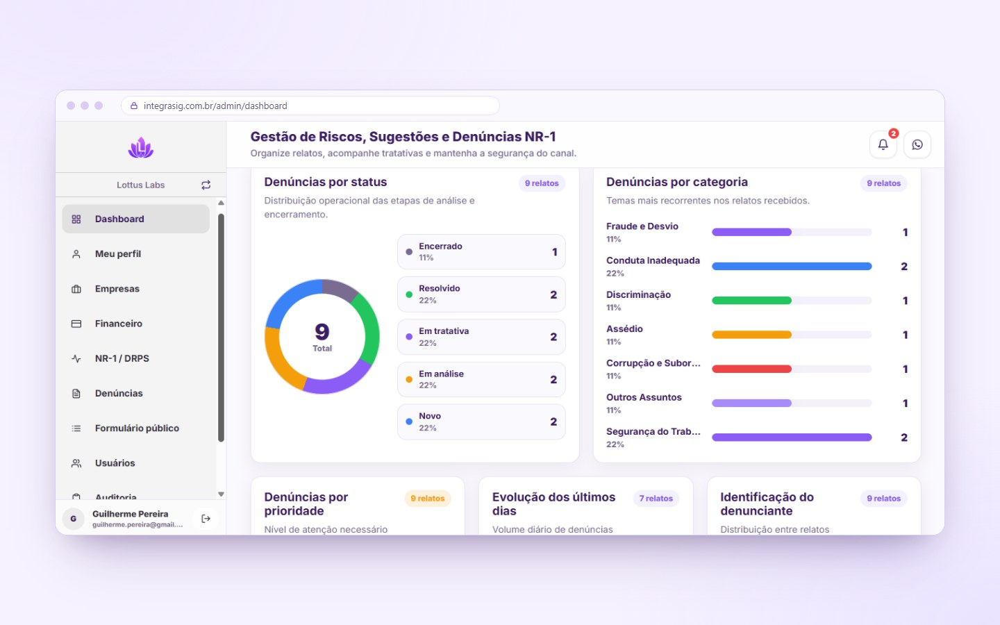
      
<b>Dashboard</b> Relatos por status, categoria, prioridade, identificação e evolução

    </td>
  </tr>
  <tr>
    <td width="50%">
      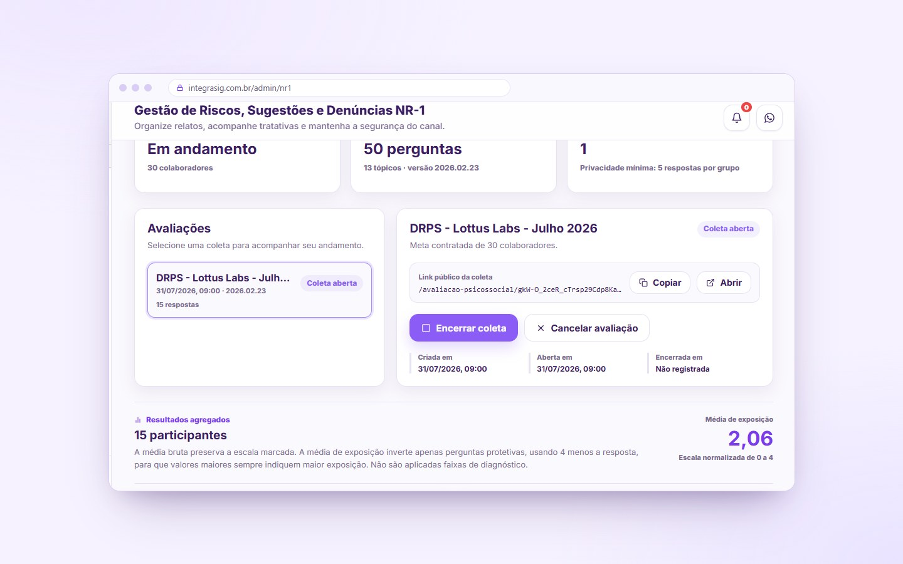
      
<b>Gestão NR-1 / DRPS</b> Coletas, link público e resultados agregados, com grupos de menos de 5 respostas omitidos

    </td>
    <td width="50%">
      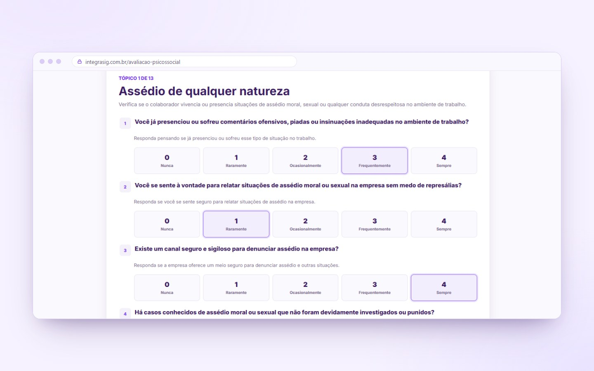
      
<b>Questionário do colaborador</b> 13 tópicos e 50 perguntas, sem login, nome, CPF ou e-mail

    </td>
  </tr>
</table>

### No celular

O canal precisa funcionar onde a pessoa estiver, muitas vezes pelo celular, a partir de um QR Code no mural da empresa. Todas as telas foram pensadas para a tela pequena.

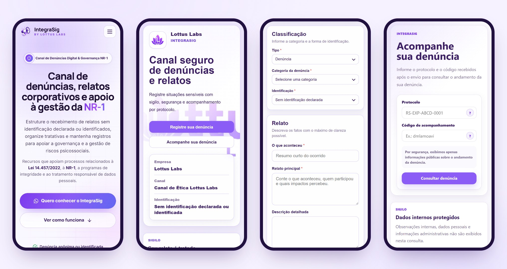

 

## Como funciona

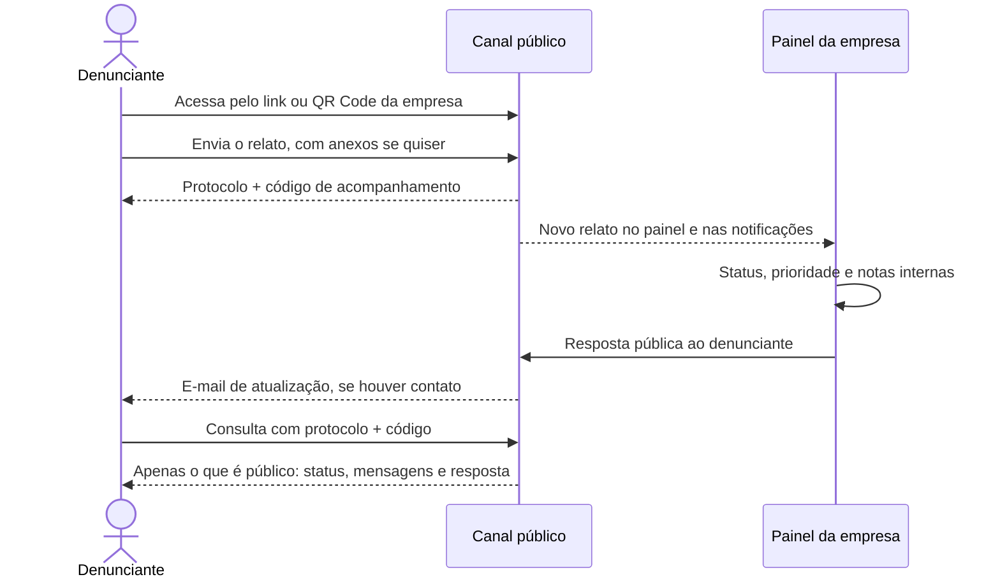

Notas internas e o histórico administrativo nunca saem do painel. O denunciante só enxerga o andamento do caso e as respostas que a empresa decidiu tornar públicas.

 

## Tecnologias

   

   

   

| Camada | Escolha |
| --- | --- |
| Frontend | Next.js 16 (App Router), React 19 e TypeScript |
| Estilos | CSS Modules com tokens próprios, sem frameworks de CSS |
| Animações | CSS puro (keyframes e transições) e IntersectionObserver |
| Backend | NestJS 11 com TypeScript, class-validator e documentação Swagger/OpenAPI |
| Banco de dados | PostgreSQL 16 com Prisma ORM e migrations versionadas |
| Autenticação | JWT em cookies HTTP-only, refresh token rotativo e CSRF |
| Segurança da API | Helmet, Throttler (limite de requisições) e bcrypt |
| Uploads | Multer, com armazenamento privado e validação de assinatura |
| E-mails | Nodemailer via SMTP, com templates em HTML e texto |
| Pagamentos | Mercado Pago (Pix, boleto e cartão) com webhooks |
| Infraestrutura | Docker Compose, Caddy (HTTPS automático) e VPS |
| CI/CD | GitHub Actions + GitHub Container Registry |

 

## Arquitetura

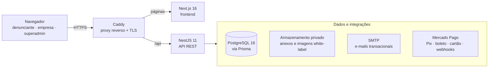

- **Monorepo** com frontend e backend separados, cada um com seu Dockerfile.
- **Multi-tenant** em um único banco: toda entidade operacional pertence a uma empresa, e o isolamento é aplicado em guards e serviços centralizados.
- **Três áreas no mesmo produto**: portal público, painel das empresas e painel de superadministração, com papéis `SUPERADMIN`, `COMPANY_ADMIN` e `ANALYST`.
- **Deploy contínuo**: a cada push na `main`, o GitHub Actions gera as imagens, publica no GitHub Container Registry e atualiza o servidor por SSH, rodando as migrations do Prisma antes de subir os containers. O servidor só baixa imagens prontas, sem build em produção.

 

## Algumas das funcionalidades

### Financeiro

- Planos **mensal** e **anual**, com cobrança por usuário ativo e módulo NR-1 cobrado por faixa.
- Ativação pela primeira mensalidade e **7 dias para avaliar**, com reembolso integral.
- Pagamento por **Pix e boleto**, e cartão no plano anual, pelo Mercado Pago, com confirmação por webhook validado.
- Faturas, notas fiscais, lembretes de vencimento, aviso de renovação anual e bloqueio automático por inadimplência, inclusive do canal público.
- Aceite obrigatório e versionado dos Termos de Uso e da Política de Privacidade.

### Portal do denunciante

- **Canal exclusivo por empresa**, acessado por link ou QR Code, sem conta e sem aplicativo.
- **Relato sem identificação declarada ou identificado**, conforme as opções que a empresa habilitou. No modo identificado, o formulário pode pedir nome, CPF e data de nascimento.
- **Formulários configuráveis**: tipo de relato, categorias, contexto (onde, quando, pessoas envolvidas, testemunhas) e até 10 anexos por envio.
- **Protocolo e código de acompanhamento** gerados no envio, para consultar o andamento e trocar mensagens com a empresa.
- **Orientações no próprio canal** sobre sigilo, privacidade e as normas relacionadas a canais de denúncia.

### Painel da empresa

- **Dashboard** com relatos por status, categoria, prioridade, tipo de identificação e evolução diária.
- **Gestão de casos** com filtros, paginação e ordenação, detalhe completo do relato, status, prioridade e anexos.
- **Notas internas e respostas públicas separadas**: o que é interno nunca aparece no portal, e uma resposta pública é obrigatória antes de encerrar um caso.
- **White-label**: logo, banner, paleta de cores (botões, fundo e destaque), fonte, textos, termos e prévia antes de publicar.
- **Compartilhamento do canal**: arte pronta com QR Code para baixar em PNG, imprimir ou enviar pelo WhatsApp.
- **Usuários e papéis**: administradores e assistentes, sempre limitados aos dados da própria empresa.
- **Auditoria** das ações relevantes e histórico de acessos da própria conta.
- **Treinamentos** em vídeo e manuais em PDF (do administrador e do denunciante) dentro do painel.

### Módulo NR-1 / DRPS

- Questionário psicossocial com **13 tópicos e 50 perguntas**, respondido por link público, sem login e sem dados pessoais.
- Coletas com meta de participantes, abertura, encerramento e cancelamento pelo painel.
- **Resultados agregados** por fator de risco, setor e função, com média de exposição normalizada.
- **Limite de privacidade**: grupos com menos de 5 respostas são omitidos automaticamente.

### Superadministração (Lottus Labs)

- Cadastro e gestão de empresas, com canal padrão criado automaticamente.
- Troca de empresa explícita e centralizada no backend para operar entre clientes.
- Bloqueio e liberação manual do acesso ao painel de cada empresa.

### E-mails automáticos

Confirmação de registro e link de acompanhamento para o denunciante, avisos de mudança de status e de resposta pública, código de redefinição de senha, lembretes financeiros e aviso de renovação.

## Segurança e privacidade

Relatos podem conter dados pessoais e sensíveis, então a segurança foi tratada como requisito desde o primeiro commit.

- **Sessões**: tokens apenas em cookies HTTP-only com SameSite estrito, rotação de refresh token e validação CSRF em todas as operações autenticadas.
- **Isolamento por empresa**: o escopo de cada usuário é resolvido no backend a partir da sessão, nunca de um `companyId` enviado pela tela.
- **Protocolo difícil de adivinhar**: gerado com bytes aleatórios criptográficos, sem sequência. O código de acompanhamento é guardado apenas como hash.
- **Rotas públicas enxutas**: o portal recebe só o que é seguro para o denunciante. Notas internas, hashes, tokens e caminhos de arquivo nunca saem do backend.
- **Anexos privados**: validação de tamanho, extensão, tipo MIME e assinatura do arquivo, armazenamento fora da área pública e download apenas por rota autenticada.
- **Rastreabilidade**: ações relevantes ficam registradas com usuário, empresa, entidade, data e contexto.
- **Proteções da API**: Helmet, limite de requisições, validação dos dados de entrada com descarte de campos não previstos e webhooks de pagamento com assinatura conferida.
- **LGPD**: coleta mínima, relato sem identificação declarada, limite de privacidade no NR-1 e aceite registrado dos documentos legais.

 

## Identidade visual

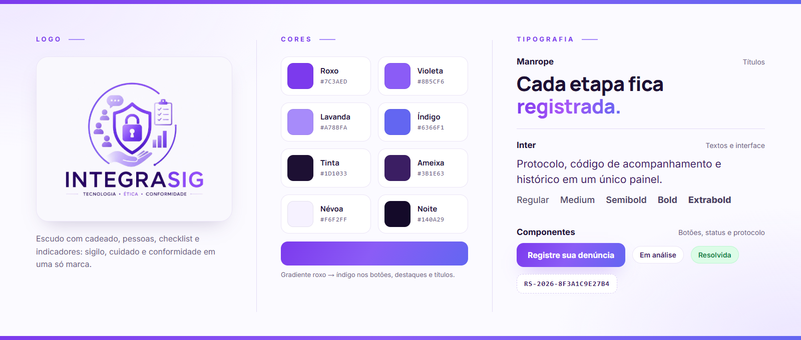

- **Logo**: escudo com cadeado, cercado de pessoas, checklist e indicadores, com o lema "Tecnologia · Ética · Conformidade". No site, o megafone roxo funciona como ícone da marca.
- **Cores**: roxo como cor de ação, do violeta ao índigo em gradiente, sobre fundos claros e cards brancos. As seções de segurança e planos usam um roxo quase preto para dar peso institucional.
- **Tipografia**: Manrope nos títulos e Inter nos textos e na interface.
- **Movimento**: revelação ao rolar, contadores animados, profundidade 3D que segue o cursor e diagramas animados, tudo em CSS e TypeScript sem bibliotecas de animação e respeitando a preferência "reduzir movimento".
- **White-label**: no canal público, logo, cores, banner e fonte passam a ser os da empresa cliente.

 

## Código-fonte

> [!NOTE]
> O código-fonte deste projeto é **privado**. Este repositório serve apenas como apresentação do trabalho.

 

## Direitos

O IntegraSig é um produto da **Lottus Labs**. Nome, marca, textos, imagens e telas pertencem à Lottus Labs. Todos os direitos reservados: não é permitido reproduzir ou reutilizar este conteúdo sem autorização.

<!-- Desenvolvido por: Guilherme Francisco Pereira (Lottus Labs)-->